**<u>Scenario 4</u>**: Compromise, enumerate, pivot

**<u>Lab Setup</u>**:
The lab consists of four virtual machines in the following topology


      ____            ____              ____
     ||__||          ||__||            ||__||  
	 [ -= ]  ----->  [ -= ]    ----->  [ -= ]
     ======          ======            ======
     kali            ubuntu            Windows
     10.10.230.*     10.10.230.*       192.168.228.*
                     192.168.228.*
                     
                         \               /
                          \             /
                           \           /
                                ____
                               ||__||  
	                           [ -= ]  
                               ======                       
                               SIEM
                               192.168.*.*

We will be attacking from the kali machine on an external network (10.10.230.\*)  The ubuntu machine is accessible to the external network and running a web and ssh services.  It uses Suricata and Splunk Universal Forwarder to send telemetry to the SIEM which is running Splunk. The Windows machine is also running Splunk Universal Forwarder and routing all traffic through the Suricata IDS/IPS.


**<u>Attack Behavior</u>**:

An attacker conducts reconnaissance against a website and discovers exposed credentials that allows ssh access to the machine.  Once, in the attacker enumerates the machine and tries to pivot further into the network.

**<u>Telemetry Sources</u>**:
	<ul>
		<li> apache2/access.log (web)
			<ul>
			<li> Source IP
			<li> HTTP method
			<li> Requested URI
			<li> Timestamp
			</ul>
		<li> auth.log (ssh)
			<ul> 
			<li> username
			<li> Source IP
			<li> Authentication Success/Failure
			</ul>
		<li> auditd
			<ul>
			<li> Session ID
			<li> TTY
			<li> Authenticaed User
			<li> Executed Commands / Arguments
			<li> Working Directory
			<li> User, UID, AUID
			</ul>
	</ul>
	
**<u>Attack Simulation</u>**:  

Lab Goal: Detect abnormal web traffic activity and trace back to signs of initial compromise.

The first phase involves the attacker conducting an nmap scan of the network:

```
$ nmap 10.10.230.*
```
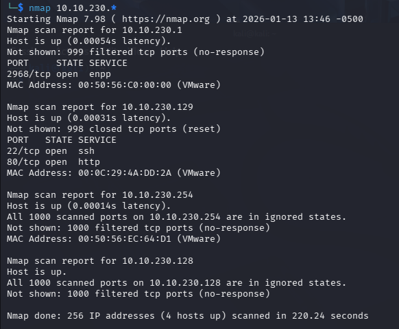

We find http and ssh ports open. Detailing these ports we find a robots.txt file with three disallowed entries:

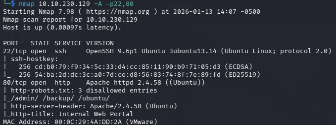

The /ubuntu endpoint looks benign 

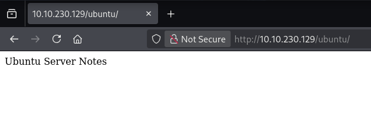
	
But when we view the source we find some hidden credentials:


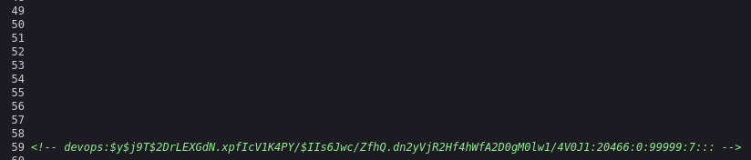

We can crack this with John the Ripper:

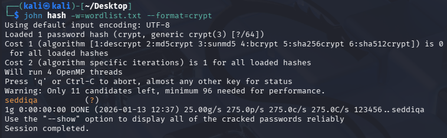
	
And use the credentials to ssh into our ubuntu box:

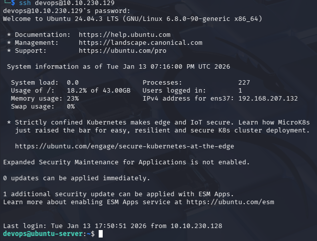
	
Next the attacker tries to enumerate the network:


	
The attacker downloads a custom script and scans an internal address:

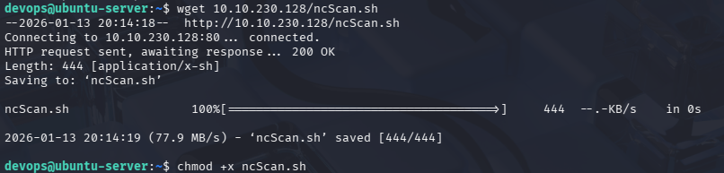
	
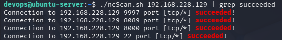

With ssh open on our internal ip address, the attacker tries the same credentials and has success:

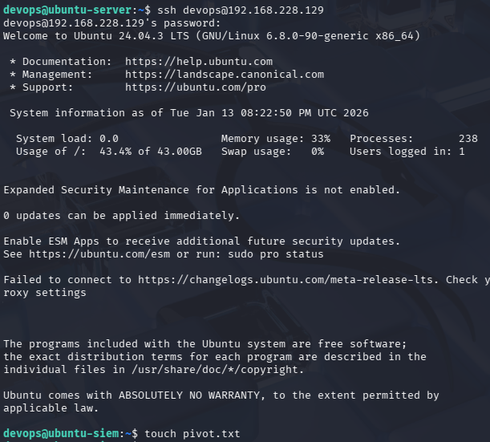
	
I then created a file for some additional noise and attempted to reach back out to our attacking machine on the external network, which of course failed.


	
**<u>Detection Chain</u>**:

In our scenario, detection begins with a user discovering the suspicious pivot.txt file on their machine.

Searching for this file:

```
index=main | search "pivot.txt"
```

returns no results.

Looking deeper by expanding our search, we see that 

```
index=main | stats count by sourcetype host
```

returns no results for ubuntu-siem at all. When setting up this lab, we did install Splunk Universal Forwarder on the SIEM server so we have not been collecting telemetry.  In the real world, this may happen because the server is considered trusted thus overlooked as a source of malicious events. Taking a zero trust approach, we'll now install and configure Universal Forwarder and autitd on the SIEM machine and begin our search again.

We now repeat our command

```
$ touch pivot.txt
```

and find it in our search

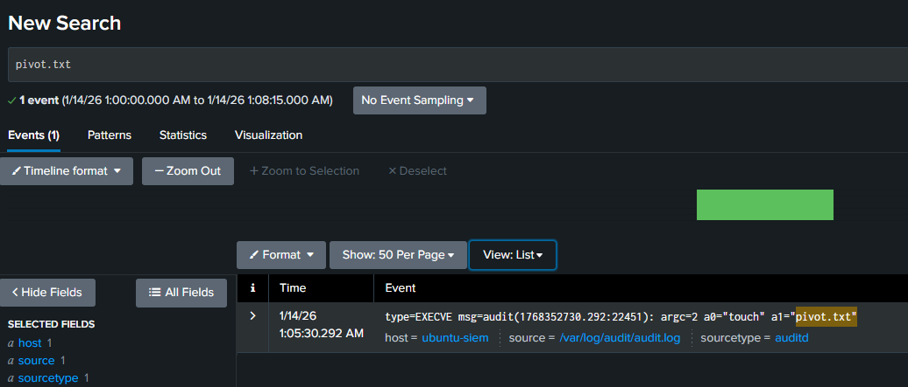

Unfortunately we don't seem to have much information other than the host and the command arguments.

We can use the audit_id to pivot to other events and logs.

```
index=main sourcetype=auditd
| rex "audit\([0-9\.]+:(?<audit_id>\d+)\)"
| search audit_id=22451
```

Shows a number of auditd log entries with our audit_id.  


We can clean these up with some regular expressions to pull data from the logs and get a better picture of what's going on.

```
index=main sourcetype=auditd
| rex "audit\([0-9\.]+:(?<audit_id>\d+)\)"
| search audit_id=3042
| rex "auid=(?<auid>\d+)"
| rex "uid=(?<uid>\d+)"
| rex "exe=\"(?<exe>[^\"]+)\""
| rex "cwd=\"(?<cwd>[^\"]+)\""
| table _time host auid uid exe cwd
```


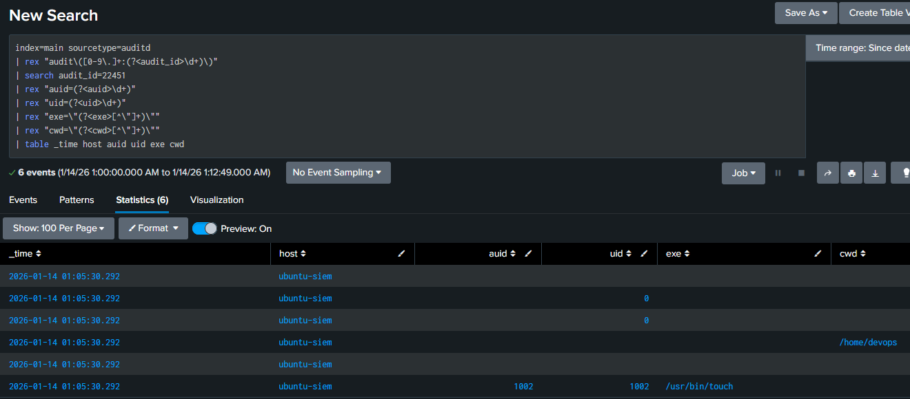

We see that userid 1002 issued the touch command. (This is our devops user).    

Examining the event:

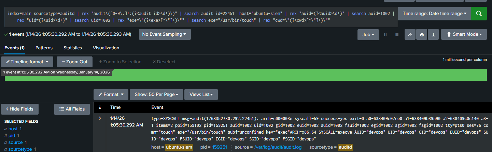

We discover touch was executed at 1:05:30.292 AM on January 14th.  during ses=76 (this stands for session), on  tty=pts1 (interactive pseudo-terminal), by auid=devops, (logged in as devops).  Since we have no physical console, SSH is a realistic connection method, and we see no other devops logins besides ssh.

```
index=main sourcetype=auditd OR sourcetype=linux_secure
| rex "Accepted password for (?<user>\S+) from (?<src_ip>[\d\.]+)"
| rex "tty=(?<tty>pts\d+)"
| rex "comm=\"(?<command>[^\"]+)\""
| search user=devops OR command=touch
| sort _time desc
```

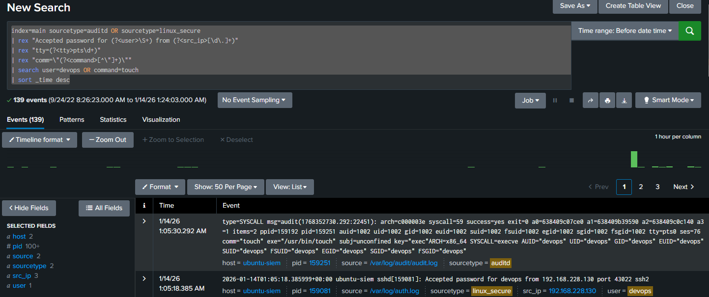
	
We see the source IP address is from an internal network node, so now we pivot back to that.

```
index=main sourcetype=suricata:json 
| search src_ip=192.168.228.130 dest_port=22 
| where dest_ip="192.168.228.129"  
| search src_ip="192.168.228.130" dest_ip="192.168.228.129" dest_port=22 proto=TCP
```

Shows an ssh connection from 192.168.228.130 just prior to our touch command.

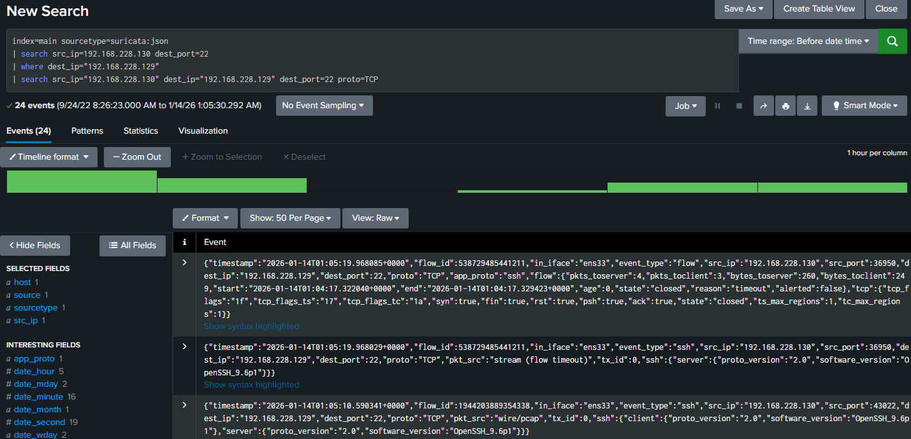
	
192.168.228.130 is our ubuntu server:

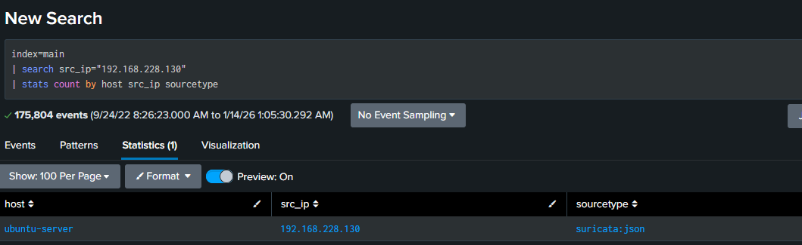

Looking back at the traffic from 130 to 129 we see a lot of different destination ports in rapid succession:

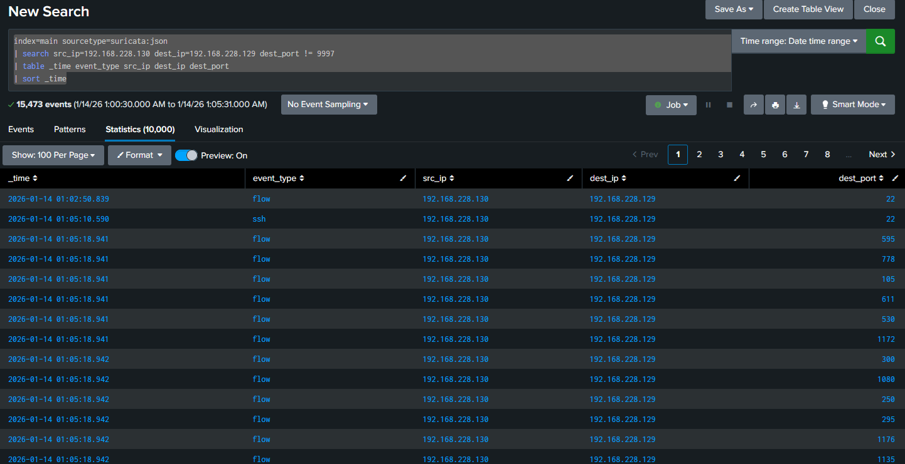
	
This is our scanning script from earlier.

Pivoting to times near this activity, we can search for commands being run
```
index=main sourcetype=auditd host=ubuntu-server
| search type=SYSCALL syscall=59
| rex "comm=\"(?<command>[^\"]+)\""
| rex "exe=\"(?<exe>[^\"]+)\""
| table _time command exe tty auid uid
| where auid = 1002
| sort _time desc
```
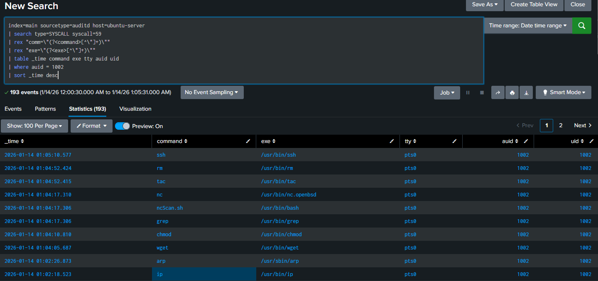
	
Here we see our nsScan.sh script, wget, arp and ip commands. We can look closer at wget by pulling the audit_id


Now we can see the wget command is calling outside our network.

```
index=main sourcetype=auditd host=ubuntu-server
| rex "audit\([0-9\.]+:(?<audit_id>\d+)\)"
| search audit_id=20716
| search type=EXECVE
```

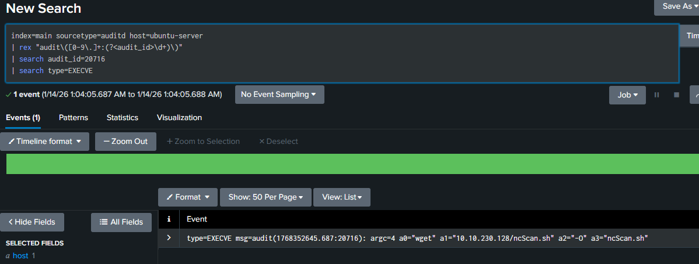
	
The session that executed wget is marked by auid (1002 / devops), tty ( pts0) and ses (75).

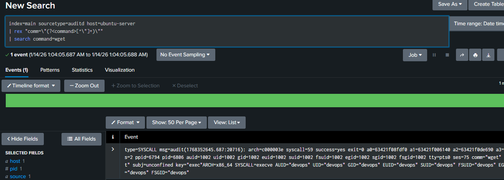
	
Tracing back, we see session 75 was opened via ssh for devops from an external address:

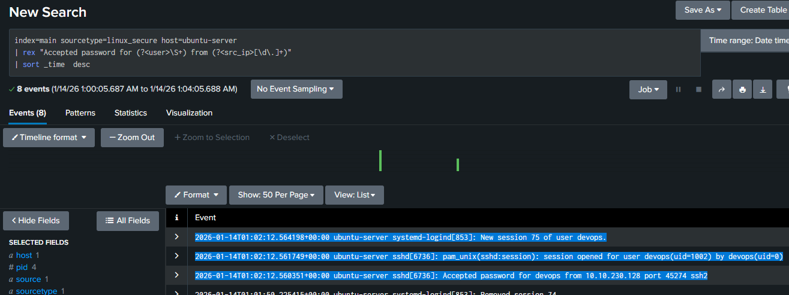

Lets see if we have any other traffic from this external network that might indicate reconnaissance. 	

```
index=main event_type=http
NOT splunk*
| search http.url IN ("/robots.txt","*/admin*","*/backup*","*/ubuntu*")
| table _time src_ip http.url http.status
```

doesn't return any external network traffic:

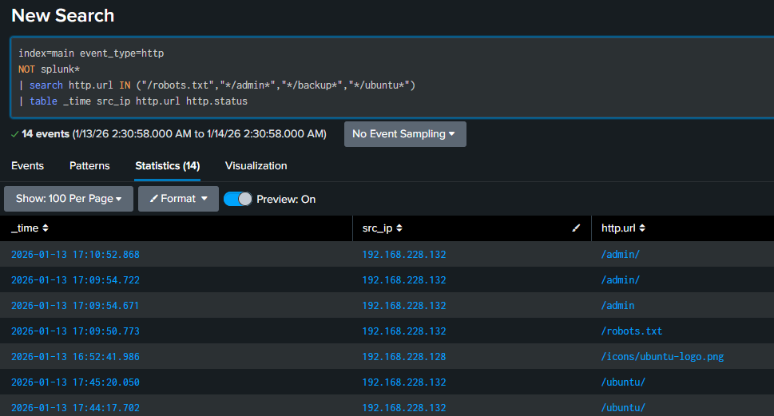
	
Well, in the last 24 hours, we've only ingested traffic from a few sources, and they don't include apache logs.

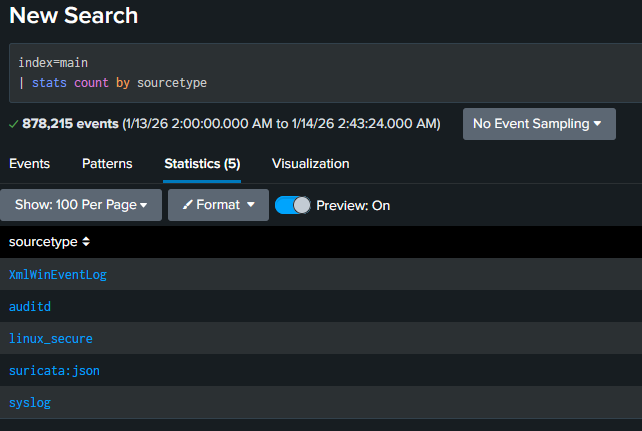

To add them, we must include them in our Universal Forwarder inputs.conf file:

```
[monitor:///var/log/apache2/access.log]
disabled = false
index = main
sourcetype = apache:access
host = ubuntu-server

[monitor:///var/log/apache2/error.log]
disabled = false
index = main
sourcetype = apache:error
host = ubuntu-server  
```

Note: apache logs are usually readable by the adm group, so we need to make sure our splunkfwd user is a member.  

After restarting UF, we can verify we are ingesting apache logs with 

```
index=main
| stats count by sourcetype
```

Because the logs haven't turned over, we can ingest our earlier attack. If they had turned over since our reconnaissance phase, UF wouldn't have sent them to Splunk. 

```
index=main sourcetype=apache:access host=ubuntu-server
| table _time _raw
| sort _time desc
```

Shows us not only our external http access, but indications of nmap scripting.


Notably, we viewed and traced these events in narrow time windows.  If the adversary had used multiple IP addresses for their reconnaissance and ingress, or spaced the attack out over time, we wouldn't have been able to pivot so easily.

|Attack Phase	|Telemetry Source	|Visibility 
| --------------|-------------------|---------- 
|Web recon		|Apache access logs	|Host
|Credential exposure|Apache access logs |	Host
|SSH login	|linux_secure	|Host
|Session creation	|auditd	|Host
|Command execution	|auditd	|Host
|Tool staging	|auditd	|Host
|Internal pivot	|Suricata	|Network
|Outbound attempt	|auditd / Suricata	|Host / Network

**<u>MITRE ATT&CK Mapping</u>**:

|Tactic	|Technique	|  Evidence|
| ----- | ----------|----------|
|Reconnaissance|	T1595|	HTTP requests from external IP
|		|                | to /robots.txt and
|||		 hidden web endpoints
|Initial Access|	T1190|	Web content exposure revealed
|||		 valid SSH credentials
|Initial Access	| T1078	|Successful SSH authentication
|||		 using exposed credentials
|Discovery	|T1082	|Host enumeration commands
|||		 executed via SSH session
|Discovery	|T1016	|Network configuration and
|||		 internal IP discovery
|Execution	|T1059	|Interactive shell command
|||		 execution (touch, wget)
|Command and Control	|T1105|	Tool transfer using wget
|||		 from remote source
|Lateral Movement	|T1021.004|	SSH authentication to
|||		 internal Linux host
|Defense Evasion	|T1070.004|	Minimal on-disk artifacts
|||		 created during activity
|Impact	|T1046	|Internal network service
|||		 scanning and probing